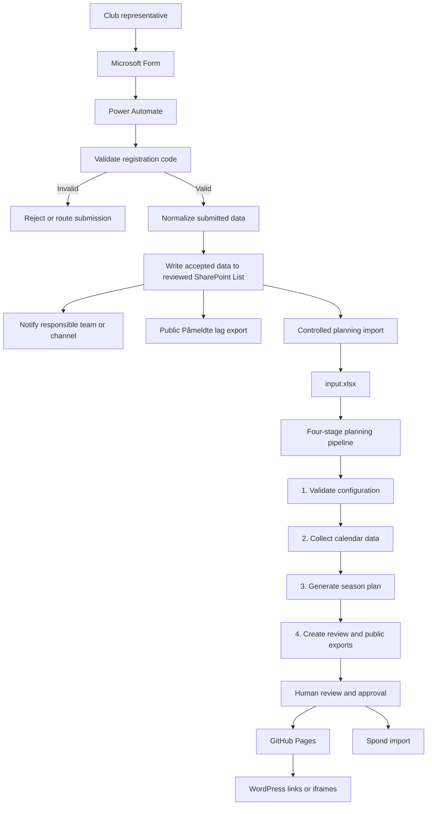

# RVV Miniputt

RVV Miniputt is the operational and technical system used to collect team registrations, maintain the activity calendar, generate the miniputt season plan, review the result, and publish approved information for Region Viken Vest.

The project spans Microsoft Forms, Power Automate, SharePoint, Excel, deterministic Python scheduling, GitHub Actions, GitHub Pages, WordPress, and Spond. This README is the starting point for a new season coordinator or technical maintainer. Detailed implementation documentation remains under [`docs/`](docs/).

## Core principles

1. **SharePoint is the reviewed registration store.** Microsoft Forms is an intake channel, not the planning source of truth.
2. **`input.xlsx` is the controlled input to the season planner.** Form responses must not replace administrative sheets or planning settings directly.
3. **Generated files are not edited manually.** Correct the source data or code, then regenerate.
4. **Generation, review, publication, and rollback are separate actions.** Public publication always requires explicit approval.
5. **Only public-safe fields are published.** Contact details, comments, internal statuses, credentials, paths, and audit data stay private.
6. **The system must be transferable.** Critical Microsoft 365, GitHub, WordPress, and Spond assets should have club-controlled ownership and at least one backup owner.

## End-to-end operating model



## Responsibilities by system

| System | Purpose | Source-of-truth status | Important boundary |
|---|---|---|---|
| Microsoft Forms | Collect club and team submissions | No | Treat responses as unreviewed input. |
| Power Automate | Validate and route form responses | No | Invalid registration codes must not create accepted registration records. |
| SharePoint List | Store reviewed registrations and workflow status | Yes, for registrations | Keep contact and internal workflow fields private. |
| `input.xlsx` | Controlled season-planning configuration | Yes, for planner input | Only the `Lag` sheet is rebuilt from approved registrations. |
| Calendar sources | Supply availability and activity data | Yes, per external source | Review stale or suspiciously sparse sources before trusting a plan. |
| Python pipeline | Validate, schedule, evaluate, and export | Derived | Hard constraints and policy must live in deterministic code or controlled input. |
| GitHub Pages | Serve generated read-only output | No | Never manually edit generated Pages files. |
| WordPress | Public navigation and explanatory content | Yes, for editorial website text | Link/embed generated output instead of duplicating it manually. |
| Spond | Operational communication and event distribution | Yes, for group communication | Import only after the season plan is approved. |

The actual public URLs are deployment configuration. Find them through the repository's GitHub Pages settings or the WordPress pages that embed/link the generated output; do not hardcode them in this README.

## Annual season workflow

### 1. Before registration opens

- Confirm Microsoft Form ownership, questions, registration code, confirmation text, and destination flow.
- Confirm the Power Automate flow and Microsoft 365 connections have club-controlled owners and a backup owner.
- Verify the SharePoint List schema and remove obsolete test rows.
- Update `input.xlsx` administrative sheets: `Innstillinger`, `Aldersgrupper`, `Kilder`, optional `Datopreferanser`, and activity sheets.
- Review GitHub, Pages, WordPress, Spond, and calendar-source access.
- Run `make check` and a dry planning run before clubs start submitting.

### 2. During registration

- Clubs submit one or more teams through Microsoft Forms.
- Power Automate validates the submitted registration code before treating the submission as accepted.
- Accepted submissions are normalized and written to the private SharePoint List.
- Rejected, duplicate, incomplete, or withdrawn registrations retain an explicit non-active status and are excluded from planning.
- The season coordinator reviews club name, team label, age group, duplicates, and status.
- The standalone **Påmeldte lag** view can be refreshed without regenerating the season plan.

### 3. Freeze and import registrations

Export the reviewed SharePoint List as CSV or XLSX. Validate it before changing the planning workbook:

```bash
scripts/rvv-miniputt registrations validate registrations.csv --input input.xlsx
scripts/rvv-miniputt registrations export registrations.csv --input input.xlsx --output input.updated.xlsx --dry-run
scripts/rvv-miniputt registrations export registrations.csv --input input.xlsx --output input.updated.xlsx
```

The import includes only approved/current/active registrations, replaces only the `Lag` sheet, preserves controlled administrative sheets, rejects invalid identities, excludes private fields, and writes an audit sidecar.

Review `input.updated.xlsx`, then deliberately promote it to the active `input.xlsx` through the normal repository process.

### 4. Update activities and source calendars

Activity information belongs in a supported workbook sheet such as `Aktiviteter`, `Aktivitetsplan`, or `Årshjul`. The export can generate `activities.json` and `activities/index.html`.

Keep date, age group, category, title, location, description, and URL structured where possible. Dates for player-development and regional gatherings may change; WordPress should explain this editorially. Tournament and championship dates should be published when confirmed.

Calendar source definitions belong in `Kilder`. Before planning:

```bash
make sources-status
make calendars
make calendars-refresh  # when a forced refresh is required
make calendars-refresh-dotenvx  # forced refresh with BookUp credentials from .env.bookup
```

For BookUp calendars that require credentials, keep secrets out of the command line and run through dotenvx with the encrypted `.env.bookup` file. Pi slash commands also auto-load missing BookUp credentials from `DOTENVX_ENV_FILE` (default `.env.bookup`) before prompting. The dotenvx private key file (`.env.keys`) must stay local and ignored by git. If Tønsberg/Sandefjord trigger Vipps or SMS MFA, re-run Stage 2 with `--manual-bookup-login` so a visible browser pauses for the operator to finish login.

A source returning very few events may not be technically blocked but can still be untrustworthy. Investigate sparse-event warnings before approval.

### 5. Generate and review the season plan

```bash
make help
make operator-run
make status
make logs
```

The checkpointed pipeline:

1. validates `input.xlsx`
2. collects and caches calendar events
3. generates and evaluates a season plan
4. exports Excel, CSV, iCal, HTML, activity, input-overview, and Spond files

A resumed run starts from the earliest missing or stale stage. Force a complete rebuild only when required:

```bash
make operator-run-force
```

Review validation warnings, source health, hosting distribution, participation counts, conflicts, generated reports, the privacy report, and pending operator questions.

```bash
make questions
make answer ID=<id> ANSWER='<answer>'
make operator-run
```

### 6. Publish approved output

```bash
make publish-preview
make publish CONFIRM_PUBLIC=1
make verify-publish
```

Only publish the exact reviewed bundle. Publication sanitizes a separate public bundle, blocks probable secrets, excludes private files, and updates `/latest/` without force-pushing history.

WordPress should link to or iframe generated views from the configured Pages deployment. Do not paste generated tables into WordPress as a permanent copy because they become stale.

### 7. Distribute through Spond

The pipeline creates Spond-oriented exports such as `season_plan_spond.xlsx`. Import or recreate events only after approval. Keep at least one backup Spond administrator and document how to correct imported events after a rollback.

### 8. Handle mid-season changes

For a late registration, withdrawal, changed activity, or calendar correction:

1. update and review the authoritative source
2. rebuild `input.xlsx` if registrations changed
3. regenerate the affected outputs
4. review the diff and privacy report
5. publish with explicit confirmation
6. update Spond and WordPress only where necessary
7. communicate the change through the established Spond group

Never patch generated HTML, CSV, Excel, Pages files, or Spond import files by hand as the permanent fix.

### 9. End of season

- Retain the final approved workbook and reviewed registration export in club-controlled storage.
- Preserve publish history required for audit and rollback.
- Export a backup of the Microsoft Form and Power Automate solution where supported.
- Review owner/admin lists and remove departed volunteers.
- Rotate credentials and update the private ownership record.
- Start the next season from controlled templates.

## Registration and Power Automate runbook

The repository cannot inspect or version the live Power Automate flow. The following behavior is therefore an operational contract that must be checked in Microsoft 365 after changes.

### Expected flow

1. Trigger when a Microsoft Forms response is submitted.
2. Retrieve full response details.
3. Normalize and validate the registration code.
4. When invalid, do not create an accepted SharePoint registration item and do not expose the valid code.
5. When valid, parse one or more team lines, create consistently structured SharePoint records, retain response/audit IDs, and notify the responsible channel.
6. A coordinator reviews records and assigns a supported status.

### SharePoint fields used by the repository

| Canonical field | Typical source names | Requirement |
|---|---|---|
| `sharepoint_id` | `ID`, `SharePoint ID`, `Item ID`, `list_item_id` | Stable and unique |
| `club` | `Klubb`, `Forening`, `club` | Must exist in controlled workbook data |
| `label` | `Lag`, `Lagnavn`, `team_name`, `label` | Unique within its age group |
| `age_group` | `Aldergruppe`, `klasse`, `age group` | Must be declared when `Aldersgrupper` exists |
| `status` | `Status`, `Godkjenningsstatus`, `approval_state` | Determines inclusion |

Accepted active statuses include `approved`, `current`, `active`, `accepted`, `godkjent`, `aktiv`, and `gjeldende`. Rejected statuses include `rejected`, `withdrawn`, `duplicate`, `incomplete`, `avvist`, `trukket`, `duplikat`, and `ufullstendig`.

### Power Automate handover checklist

- [ ] The flow is club-owned and has a backup co-owner.
- [ ] Form, SharePoint, Teams, and notification connections are documented privately.
- [ ] Invalid codes cannot reach the accepted SharePoint branch.
- [ ] The valid code is absent from help text, errors, logs, and notifications.
- [ ] Multiple team lines are parsed deterministically.
- [ ] Retries do not silently create duplicate active teams.
- [ ] SharePoint item IDs and Forms response IDs are retained for audit.
- [ ] Contact details cannot leak into public output or artifacts.
- [ ] The flow/solution is exported after major changes and before handover.

## Standalone registered-team publication

```bash
make registered-teams CSV=downloads/Miniputt-26-27.csv
make registered-teams-publish CSV=downloads/Miniputt-26-27.csv CONFIRM_PUBLIC=1
```

This updates the public team list without changing `input.xlsx` or regenerating season/activity output. Extra contact, ID, status, and comment columns are ignored in public output.

## Browser-only GitHub workflow

Volunteers who should not run local commands can use manual workflows under **GitHub → Actions**:

| Workflow | Purpose | Public write? |
|---|---|---|
| `Sesong: valider inndata` | Validate workbook and upload evidence | No |
| `Sesong: lag vurderingspakke` | Generate a candidate review bundle and publication preview | No |
| `Sesong: publiser godkjent pakke` | Publish an exact reviewed artifact and fingerprint | Yes, through protected environment |
| `Sesong: rull tilbake publisering` | Restore `/latest/` to a previous published run | Yes, through protected environment |

Generation and publication must remain separate.

## Common commands

| Task | Command |
|---|---|
| Show available operations | `make help` |
| Install locked dependencies | `make install` |
| Run canonical checks | `make check` |
| Verify dependency lock | `make dependency-lock` |
| Full resumable operator run | `make operator-run` |
| Force complete rerun | `make operator-run-force` |
| Raw four-stage run | `make run ARGS='--input input.xlsx'` |
| Raw run with dotenvx credentials | `make run-dotenvx ARGS='--input input.xlsx'` |
| Inspect status/logs | `make status`, `make logs` |
| Inspect/refresh calendars | `make calendars`, `make calendars-refresh`, `make calendars-refresh-dotenvx` |
| Inspect source health | `make sources-status` |
| List/answer questions | `make questions`, `make answer ID=<id> ANSWER='<answer>'` |
| Preview publication | `make publish-preview` |
| Publish reviewed bundle | `make publish CONFIRM_PUBLIC=1` |
| Verify publication | `make verify-publish` |
| Show publication history | `make publish-history` |
| Roll back | `make rollback RUN_ID=<id> CONFIRM_PUBLIC=1` |

Mutating commands retain explicit gates. `make`, `make help`, `make run`, and `make operator-run` do not publish publicly.

## Inputs and outputs

`input.xlsx` is the only supported primary planning input.

Required sheets:

- `Innstillinger`
- `Lag`

Common optional sheets:

- `Aldersgrupper`
- `Kilder`
- `Datopreferanser`
- `Aktiviteter`, `Aktivitetsplan`, or `Årshjul`

Common generated output includes season-plan Excel/CSV/iCal/HTML files, the Spond workbook, calendar report, input overview, activity JSON/HTML, registered-team artifacts, manifests, checkpoints, logs, fingerprints, privacy reports, and audit files.

See [`docs/rvv-miniputt-input-formats.md`](docs/rvv-miniputt-input-formats.md) for exact fields and validation rules.

## Troubleshooting

### A valid registration is missing

Find the Forms response and Power Automate run, confirm code validation succeeded, confirm the SharePoint item has an accepted status, export again, run registration validation, and inspect spelling/duplicate rules.

### Invalid submissions are stored as accepted

Treat this as a Power Automate defect. Repair or disable the accepted branch before relying on new submissions. Repository validation is a second safety layer, not a substitute for correct intake validation.

### Activities are missing

Confirm the activity sheet name and fields, regenerate Stage 4, publish the reviewed bundle, and verify WordPress uses the configured current Pages deployment.

### Calendar data looks incomplete

Run `make sources-status`, inspect sparse warnings, refresh or repair the source, then resume. Do not approve a schedule solely because Stage 2 technically completed.

### A run stopped halfway

```bash
make status
make logs
make operator-run
```

The pipeline normally resumes from the earliest incomplete or stale stage.

### The public result is wrong

```bash
make publish-history
make rollback RUN_ID=<id> CONFIRM_PUBLIC=1
make verify-publish
```

Then correct the source and generate a new reviewed bundle.

### Power Automate is unavailable

Use a Forms response export as a temporary private recovery source, manually review it, transform it into the documented interchange columns, validate it, and record the recovery. Do not copy unreviewed contact data into `input.xlsx` or public output.

### The primary maintainer is unavailable

Follow [`docs/ownership-and-handover.md`](docs/ownership-and-handover.md). Recover through club-owned accounts, rotate credentials, freeze publication until current output is reviewed, and have a second person complete the dry run.

## Repository map

| Path | Purpose |
|---|---|
| `input.xlsx` | Controlled season-planning workbook |
| `tournament_scheduler/` | Canonical validation, scraping, scheduling, export, and operator logic |
| `scripts/rvv-miniputt` | Portable repository-local CLI launcher |
| `scripts/check` | Canonical local/CI verification entry point |
| `Makefile` | Human-discoverable command menu |
| `.github/workflows/` | CI and manual validation/review/publish/rollback workflows |
| `.pipeline/` | Generated local checkpoints, logs, decisions, and run state |
| `export/` | Generated review/export output |
| `registered-teams/` | Standalone registered-team review artifacts |
| `docs/` | Detailed architecture, input, pipeline, security, and handover documentation |
| `.claude/`, `.opencode/`, `.codex/`, `.pi/` | Thin harness-specific adapters over canonical commands |

## Installation

Prerequisites: Python 3.10+, `python3 -m venv`, and `pip`.

```bash
git clone https://github.com/region-viken-vest-hockey/hockey.git
cd hockey
make install
make check
```

Install Playwright browser binaries where calendar scraping requires them:

```bash
INSTALL_PLAYWRIGHT=1 make install
```

`pyproject.toml` is the canonical direct dependency declaration. Deterministic installs and CI use the committed hash-checked `requirements.lock`.

## Documentation

- [Pipeline and operator guide](docs/rvv-miniputt-pipeline.md)
- [Input formats and SharePoint registration export](docs/rvv-miniputt-input-formats.md)
- [Ownership and handover](docs/ownership-and-handover.md)
- [Run manifest and durable decisions](docs/run-manifest-schema.md)
- [Security](docs/security.md)
- [AI operator product direction](docs/ai-operator-product-direction.md)
- [AI operator roadmap](docs/ai-operator-roadmap.md)

## Handover acceptance test

A new volunteer should be able to:

- [ ] access the club-owned Form, Power Automate flow, SharePoint List, repository, protected publication environment, WordPress, and Spond
- [ ] explain which system is authoritative for registrations, planning input, public editorial text, and communication
- [ ] validate a reviewed SharePoint export
- [ ] rebuild `Lag` without changing administrative sheets
- [ ] verify activity and calendar sources
- [ ] generate a review bundle without publishing
- [ ] inspect warnings, plan quality, and privacy output
- [ ] publish through explicit approval or rehearse the protected workflow
- [ ] locate the configured public deployment and verify it
- [ ] find publication history and perform a controlled rollback
- [ ] recover temporarily when Power Automate or a calendar source is unavailable

When a step still depends on undocumented personal knowledge, update this README or linked operational documentation before handover is considered complete.
