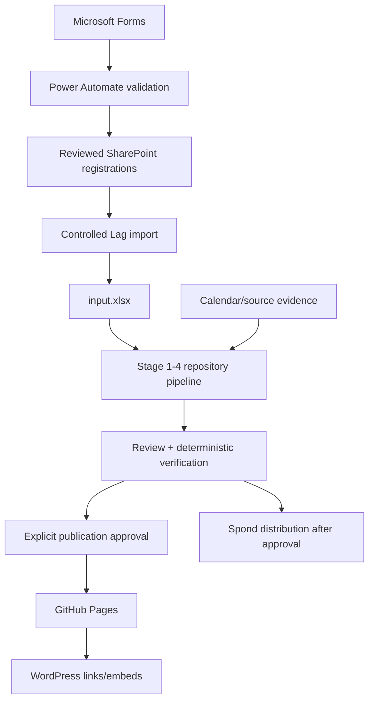

# RVV Miniputt

RVV Miniputt is the operational system used to collect reviewed team registrations, gather calendar evidence, generate and evaluate the miniputt season plan, and publish approved information for Region Viken Vest.

The root README is the human/operator entry point. The maintained documentation map and precedence rules are in [`docs/README.md`](docs/README.md).

## Source-of-truth model

1. **SharePoint** is the reviewed registration store.
2. **Root `input.xlsx`** is the controlled season-planning input. Registration import replaces only `Lag`; administrative/planning sheets remain controlled.
3. **Calendar/source data** supplies availability evidence and must pass source-health/provenance checks before it is trusted.
4. **Repository code/tests** own deterministic parsing, hard constraints, measurement, persistence, export, and publication safety.
5. **`.agents/skills/rvv/SKILL.md`** is the shared agent runbook for contextual soft decisions.
6. **GitHub issues** are the live implementation backlog. ADRs preserve durable architecture decisions.

Generated files are derived data. Correct the source/config/code and regenerate instead of maintaining manual fixes in generated HTML, CSV, Excel, iCal, Pages, or Spond files.

## End-to-end flow



## Normal operator workflow

### 1. Maintain registrations and workbook

Review registrations in the private SharePoint workflow, then validate/export them into a controlled workbook copy:

```bash
scripts/rvv-miniputt registrations validate registrations.csv --input input.xlsx
scripts/rvv-miniputt registrations export registrations.csv --input input.xlsx --output input.updated.xlsx --dry-run
scripts/rvv-miniputt registrations export registrations.csv --input input.xlsx --output input.updated.xlsx
```

Review the resulting workbook deliberately before promoting it to root `input.xlsx`. See [`docs/rvv-miniputt-input-formats.md`](docs/rvv-miniputt-input-formats.md) for the canonical workbook contract.

### 2. Check calendar/source health

```bash
make sources-status
make calendars
```

A technically successful scrape can still be suspiciously sparse. Repair or review uncertain sources before trusting the plan. Credential/MFA/browser recovery behavior belongs in the shared RVV runbook and pipeline guide, not in this README.

### 3. Generate and review

```bash
make help
make operator-run
make status
make logs
```

The pipeline validates `input.xlsx`, gathers source data, plans/evaluates the season, and creates review/export artifacts. It resumes from checkpoint state when possible.

When explicit operator input is required:

```bash
make questions
make answer ID=<id> ANSWER='<answer>'
make operator-run
```

Review hard verification, manual-placement/conflict output, participation/hosting/temporal fairness, source uncertainty, rules/report content, and the privacy/public-bundle report before publication.

### 4. Publish only an approved bundle

```bash
make publish-preview
make publish CONFIRM_PUBLIC=1
make verify-publish
```

Generation, review, and publication are separate actions. WordPress should link/embed generated Pages output rather than maintain another copy of generated schedules.

### 5. Mid-season changes

Update the authoritative source, regenerate the affected output, review the diff, publish deliberately, and update Spond/WordPress only where needed. Do not patch generated output as the permanent fix.

## Common commands

| Task | Command |
|---|---|
| Discover operations | `make help` |
| Verify repository | `make check` |
| Goal-oriented run | `make operator-run` |
| Force full rerun | `make operator-run-force` |
| Status/logs | `make status`, `make logs` |
| Source health | `make sources-status` |
| Refresh calendars | `make calendars-refresh` |
| Pending questions | `make questions` |
| Publication preview | `make publish-preview` |
| Publish | `make publish CONFIRM_PUBLIC=1` |
| Verify publication | `make verify-publish` |
| Publication history | `make publish-history` |
| Roll back | `make rollback RUN_ID=<id> CONFIRM_PUBLIC=1` |

The portable repository launcher is `scripts/rvv-miniputt`; the Python fallback is `python3 -m tournament_scheduler.cli.rvv_cli`.

## Repository map

| Path | Purpose |
|---|---|
| `input.xlsx` | Controlled season-planning workbook |
| `tournament_scheduler/` | Validation, source collection, planning, verification, export, and operator logic |
| `scripts/rvv-miniputt` | Portable CLI launcher |
| `Makefile` | Human command menu |
| `.pipeline/` | Local generated checkpoints/logs/decisions |
| `export/` | Generated review/export output |
| `docs/` | Maintained docs, ADRs, external references, and retained history |
| `.agents/skills/rvv/` | Canonical shared agent runbook |
| `.claude/`, `.chatgpt/`, `.codex/`, `.opencode/`, `.pi/` | Thin harness adapters/integrations |

## Handover

The system must be transferable and should not depend on undocumented personal knowledge. Critical Microsoft 365, GitHub, WordPress, Spond, and calendar-source assets should have club-controlled ownership and backup access.

See [`docs/ownership-and-handover.md`](docs/ownership-and-handover.md) for the full handover/access procedure. A replacement maintainer should be able to validate registrations, rebuild `Lag`, verify sources, generate a review bundle, inspect plan quality/privacy findings, publish through explicit approval, and recover/rollback without borrowing the previous maintainer's personal login.

## Documentation

Start with [`docs/README.md`](docs/README.md). It separates current operational documentation from ADRs, external references, and historical material. GitHub issues—not roadmap documents—are the current implementation backlog.
