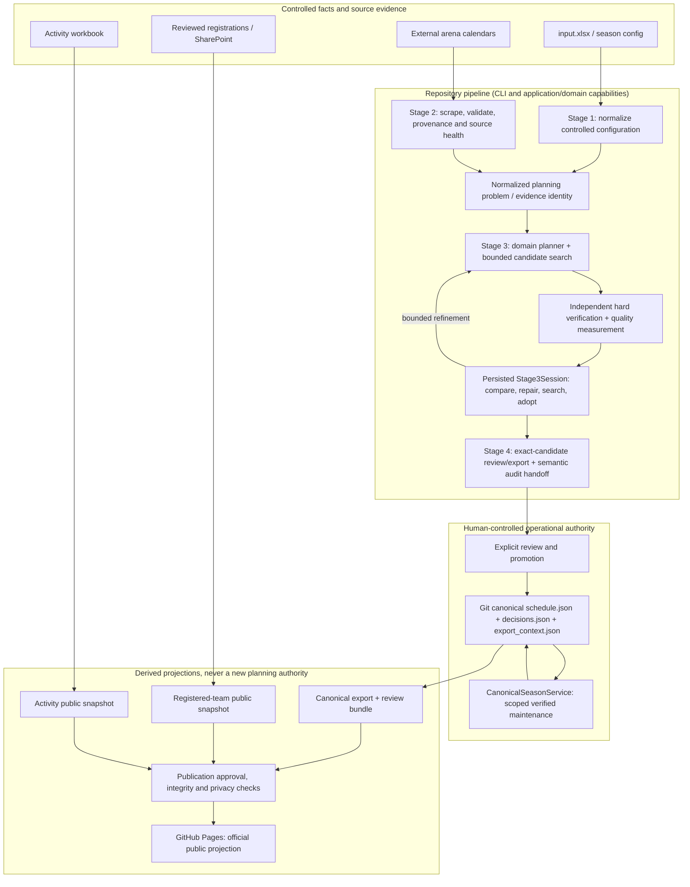
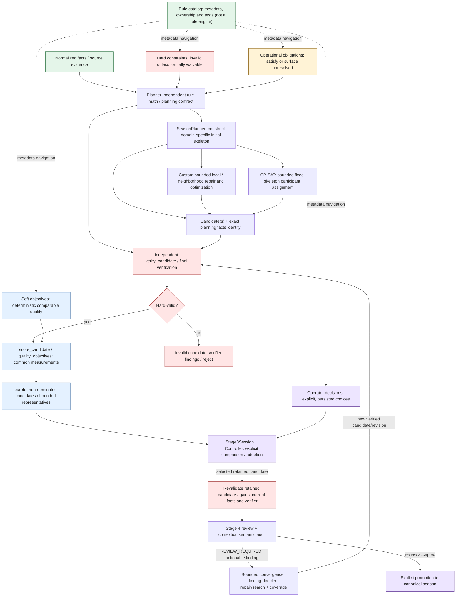
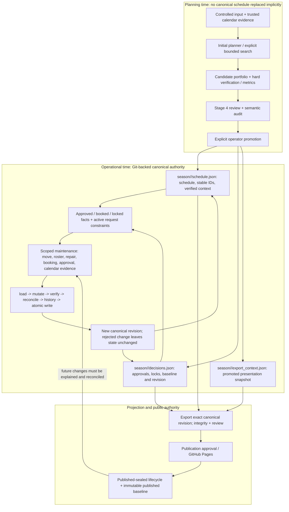

# Planning and decision architecture

<!-- Maintained semantic architecture, not an Archify/import-generated inventory.
     Update alongside owner changes; rule classifications are generated only in rule-catalog.md.
     Diagrams are rendered and local links checked by CI. -->

This is the focused visual companion to the [system architecture](../system-architecture.md). The [application architecture](../application-architecture.md) owns dependency direction; this page maps **planning decisions and authority**. The [generated rule catalog](rule-catalog.md) owns stable semantic IDs, their classifications, canonical owners and tests. The diagrams explain relationships, not new scheduling policy. Read [ADR 0001](../adr/0001-stage-3-v2-generic-optimization-and-portable-bookup-session-handoff.md) and [ADR 0003](../adr/0003-interactive-stage3-session-state-machine.md) for the durable decision rationale.

## System and data flow

The workbook owns **initial** planning input, while calendar sources own their observed evidence; evidence must pass repository normalization/provenance checks before use. A Stage 4 review bundle may exist before promotion. After promotion, the Git-backed canonical state owns the operational schedule and promoted context; an export is a projection. The public view is the official published projection, not a reason to regenerate or silently replace the Git canonical season. Registration and activity publications are separate workflows that share the sanitized Pages bundle. See [pipeline operations](../rvv-miniputt-pipeline.md) and [deployment/publication](../rvv-miniputt-deployment-architecture.md).

## Planning and decision model

**Semantics and limits.** The five primary kinds are `hard_constraint`, `operational_obligation`, `soft_objective`, `operator_decision` and `fact_evidence_semantic`; follow the [generated classification and per-rule ownership](rule-catalog.md), not a manually maintained second rule table. A hard rule blocks an invalid candidate unless that specific rule supports an explicit formal waiver. An operational obligation is fulfilled or remains visible as unresolved work. A soft objective affects comparison, not legality; an operator decision records an authorized choice; facts/evidence feed the rule implementations without being scheduling rules themselves.

The [custom planner](../../tournament_scheduler/season_planner.py) constructs an initial schedule; [generic local optimizer](../../tournament_scheduler/stage3_optimizer.py) and [CP-SAT](../../tournament_scheduler/stage3_cpsat.py) explore candidate neighborhoods. In this repository CP-SAT operates on the baseline's fixed date/host/arena/start-time skeleton and optimizes participant assignments: it is **not** an alternate owner of hockey rules or a whole-season replanner. Both planning paths must respect [shared domain rule math](../../tournament_scheduler/planning_contract.py), and the [independent verifier](../../tournament_scheduler/planning_contract.py) (`verify_candidate`) decides hard legality; [final verification](../../tournament_scheduler/final_verification.py) adds export-only integrity/readiness checks.

The [score contract](../../tournament_scheduler/planning_contract.py) (`score_candidate`) feeds [planner-independent quality dimensions](../../tournament_scheduler/quality_objectives.py), whose objective vector is oriented lower-is-better. [Canonical Pareto arithmetic](../../tournament_scheduler/pareto.py) owns dominance and bounded representative selection, while [application Pareto convergence](../../tournament_scheduler/application/pareto_convergence.py) owns frontier retention, epochs, search coverage, plateau and terminal vocabulary. The [convergence driver](../../tournament_scheduler/application/convergence_refinement.py) composes those mechanics with existing repair providers and verifier; it does not invent new hockey legality or scores. A frontier covers **observed bounded candidates only**: no global optimality claim. [Stage3Session](../../tournament_scheduler/application/stage3_session.py) and [Stage3Controller](../../tournament_scheduler/application/stage3_controller.py) own revision-bound selection/adoption; selecting a retained candidate rechecks facts identity and hard validity. The [semantic audit lifecycle](../../tournament_scheduler/application/audit_lifecycle.py) offers contextual review/refinement, not an alternative hard verifier.

## Season lifecycle and authority

[CanonicalSeasonService](../../tournament_scheduler/application/canonical_season_service.py) is the stable public application facade; [canonical lifecycle](../../tournament_scheduler/application/canonical_season/lifecycle.py) performs verification/reconciliation/history, and [CanonicalSeasonStore](../../tournament_scheduler/infrastructure/canonical_season_store.py) owns the durable atomic write. Approved or booked facts, granular [change protections](../../tournament_scheduler/change_protections.py), [request constraints](../../tournament_scheduler/request_constraints.py) and the [canonical baseline](../../tournament_scheduler/canonical_baseline.py) constrain future mutations. The [season quality baseline](../../tournament_scheduler/season_baseline.py) records accepted **non-hard historical debt** and detects new/regressed findings: it never edits the plan or globally weakens a hard rule. Bounded participation acceptance and explicit rule-specific waivers are distinct mechanisms.

After publication, the [published-sealed lifecycle](../../tournament_scheduler/published_baseline.py) forbids silent full regeneration, a sealed scoped mutation is authorized only by the [application layer](../../tournament_scheduler/application/canonical_season/scoped_mutation.py) re-running the typed operation and requiring the candidate to equal the reproduced result as a whole plan minus reconciliation-owned derived/reporting projections (a caller-built contract, mode string, affected-id list or capability object is never authorization), and [mutation reconciliation](../../tournament_scheduler/published_mutation_history.py) accounts for each operational change against the immutable published baseline. An emergency reopening is explicit, not a side effect of running a planner. [Canonical export evidence](../../tournament_scheduler/pipeline/canonical_export_evidence.py), [projection guards](../../tournament_scheduler/pipeline/export_projection_guard.py) and [publication guards](../../tournament_scheduler/pipeline/pages_publish.py) preserve the reviewed revision's identity. Generated exports are review/public artifacts; GitHub Pages is the official public view and promoted Git state is the machine-readable operational truth.

## Concept and owner routing

| Concept | Architectural role and canonical owner |
|---|---|
| Rules and categories | [Metadata-only rule catalog](../../tournament_scheduler/rule_catalog.py); [generated navigation](rule-catalog.md) |
| Legality / required work | [Independent planning verifier](../../tournament_scheduler/planning_contract.py), [final/export verifier](../../tournament_scheduler/final_verification.py) and catalog-linked findings |
| Custom initial planner | [SeasonPlanner](../../tournament_scheduler/season_planner.py): domain-specific initial construction |
| Search mechanisms | [Local optimization](../../tournament_scheduler/stage3_optimizer.py), [fixed-skeleton CP-SAT](../../tournament_scheduler/stage3_cpsat.py), focused repair providers |
| Soft quality | [Shared scoring/quality vector](../../tournament_scheduler/quality_objectives.py) derived from `score_candidate` |
| Multi-objective retention | [Pareto dominance](../../tournament_scheduler/pareto.py) and [bounded archive/convergence](../../tournament_scheduler/application/pareto_convergence.py) |
| Stage 3 decisions | [Session](../../tournament_scheduler/application/stage3_session.py), [controller](../../tournament_scheduler/application/stage3_controller.py), [convergence composition](../../tournament_scheduler/application/convergence_refinement.py) |
| Semantic audit | [Audit lifecycle](../../tournament_scheduler/application/audit_lifecycle.py) and [finding direction bridge](../../tournament_scheduler/application/audit_convergence.py) |
| Accepted historical debt | [Non-hard baseline](../../tournament_scheduler/season_baseline.py), not a verifier waiver |
| Canonical mutation | [Service facade](../../tournament_scheduler/application/canonical_season_service.py) / [single lifecycle](../../tournament_scheduler/application/canonical_season/lifecycle.py) / [store](../../tournament_scheduler/infrastructure/canonical_season_store.py) |
| Published authority | [Sealed baseline](../../tournament_scheduler/published_baseline.py), [mutation history](../../tournament_scheduler/published_mutation_history.py), [Pages publication](../../tournament_scheduler/pipeline/pages_publish.py) |

## How to use this architecture

Before changing planning behavior, find the semantic's stable ID and classification in the [generated rule catalog](rule-catalog.md). Follow its owner, verifier/measurement, providers, evidence and tests; decide whether the change belongs in rule math, candidate generation/search, shared quality/Pareto, Stage 3 lifecycle, canonical maintenance, source/audit or export/publication. Do not implement a second hockey rule in CP-SAT, the custom planner or an agent prompt. For promoted seasons, check the canonical revision, approvals/locks, baseline, booking evidence and published-sealed state; use a scoped, verified mutation rather than re-running initial planning. Consult [shared agent instructions](../../AGENTS.md) and [the RVV operator runbook](../../.agents/skills/rvv/SKILL.md).

**Regeneration:** these three Mermaid diagrams are human-maintained semantic diagrams, not generated from imports. Archify may supply a supplementary structural snapshot, but it must not overwrite these diagrams or the generated rule catalog. See [architecture regeneration guidance](README.md). Run `scripts/check architecture-docs` and the Mermaid render job before merging architecture changes.
